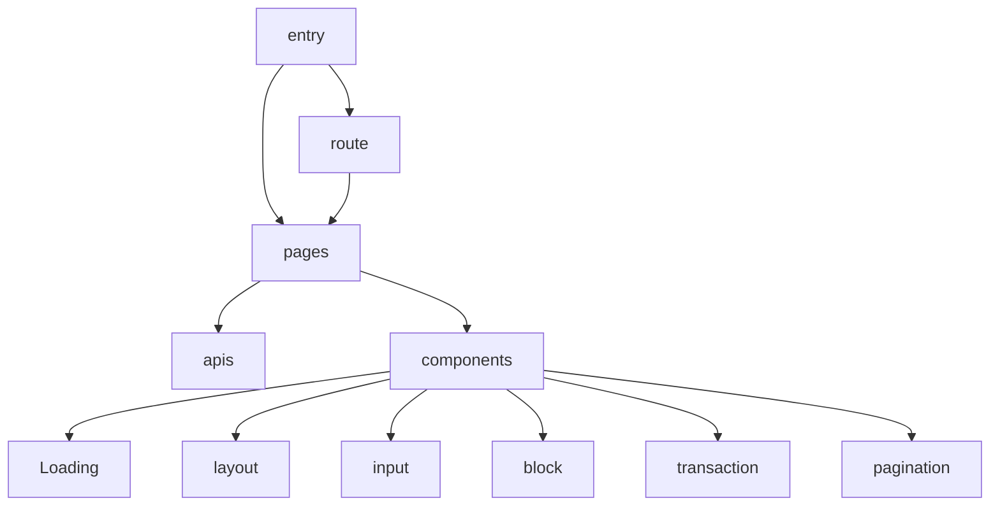

# arcblock_demo 开发文档(MarkDown打开)

## 需求设计

- 可以部署到 [Blocket Server]:https://docs.arcblock.io/en/abtnode/ 的应用

- 页面需求
  - 查询 Block Hash 的输入框，展示 Block 中包含的所有 Transaction
  - 把根比特币 Block 和 Transaction 渲染成上下二分结构，包含区块摘要和分页的交易列表，交易列表使用后端分页查询
- 组件测试 & cover 报告
- 移动端适配

## 详细设计

### Blocket Server 环境搭建

- Linux | macOS 操作系统

- 安装nvm ``` /bin/bash -c "$(curl -fsSL https://raw.githubusercontent.com/nvm-sh/nvm/master/install.sh)"```

- 安装 Node.js 和 npm ```nvm install --lts``` **Blocket Server 会在第一时间适配 Node.js LTS 版本，所以推荐安装 LTS 版本 Node.js**

- 安装 Nginx 

  - [Mac]:https://formulae.brew.sh/formula/nginx 使用 Homebrew ```brew install nginx```

  - [Linux]:https://www.nginx.com/resources/wiki/start/topics/tutorials/install/

- 安装初始化 ABT 钱包 http://abtwallet.io/ **移动端**

- 安装 Blocket CLI ```npm install -g @blocklet/cli```

- 创建运行 Blocket Server

  - 运行 `mkdir -p ~/blocklet-server-data && cd ~/blocklet-server-data` 命令进入目录。 可以将 `~/blocklet-server-data` 替换为任何其他目录
  - 运行 `blocklet server init` 命令初始化 Blocklet Server
  - 执行初始化命令后，系统将确认您要存储配置的目录。
  - 确认后，系统将自动生成您的 Blocklet Server 配置。
  - 执行 `blocklet server start` 启动 Blocklet Server

- Access Blocklet Server

  - 上述命令将启动 Blocklet 服务器。 您可以通过 `http://192.168.3.28/admin/` 或 `https://192-168-3-28.ip.abtnet.io/admin/` 访问 Blocklet Server（请将替换 `192.168.3.28` 为您的本地网络ip）。 在此之后，您必须在访问 Blocklet Server 仪表板之前同意许可条款。
  - **请不要使用 localhost 或 127.0.0.1 地址访问 Blocklet 服务器。 您将无法使用 ABT 钱包连接它。**

### 页面开发

#### 页面架构



## 待优化列表

### 环境相关

- webpack配置
  - 别名
  - postcss-pxtorem 进行移动端适配
- 开发配置
  - 不支持自定义组件的 import { } 解构语法